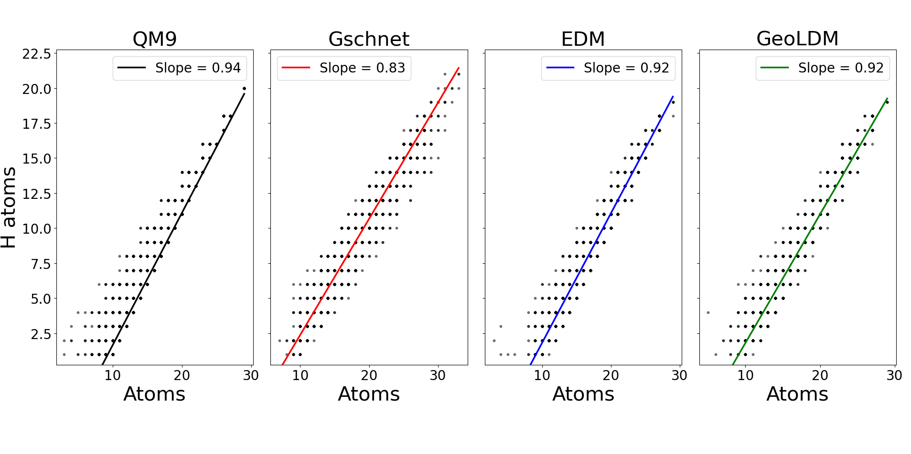

# Comparison of Molecular Generation Models: GSchNet, EDM, and GeoLDM

## Models 

This repository contains three generative deep learning models for molecular generation:

- **G-SchNet**
- **EDM (E(n)-equivariant Diffusion Model)**
- **GeoLDM (Geometric Latent Diffusion Model)**

> **Important!** The models are provided for data storage purposes, such as hyperparameters, arguments, and trained models. Due to numerous dependencies across the different model's data, they may not run directly. Instructions for cloning and running these models can be found here:  🔗 [Maurer Group Docs](https://maurergroup.github.io/MaurerGroupDocs/)

## Datasets in this Work

All training  and generated datasets can be found in `MChem_DGMs/analysis/Databases`.

### G-SchNet
- Trained on: `QM9`, `OE62`, and `GEOM-DRUGS`

### EDM
- Trained on: `QM9`, `OE62`, and `GEOM-DRUGS`

### GeoLDM
- Trained on: `OE62` only and was not able to train successfully, so no molecules were generated. 💾 You can download the pretrained models for `QM9` and `GEOM-DRUGS` from the following link:  🔗 [Download Pretrained Models](https://drive.google.com/drive/folders/1EQ9koVx-GA98kaKBS8MZ_jJ8g4YhdKsL)

## Analysis

All analysis can be performed on filtered and non-filtered datasets.  
All analyses (except saturation analysis) can be sampled—either by weight or atom count—to match the training data.  
This sampling method is the same as used in the [G-SchNet biases paper](https://pubs.acs.org/doi/10.1021/acs.jcim.5c00665).

### SMILES

Almost all analyses run on SMILES! To add SMILES to your database, use the script at:  
`MChem_DGMs/analysis/scripts/smiles/SMILES.ipynb`

### Filtering

The `MChem_DGMs/analysis/scripts/filtering` directory contains scripts and tools for post-processing and filtering generated molecules. 

- The `MChem_DGMs/analysis/scripts/filtering/filter_disconnects.py` script will filter the database by taking the largest fragment from a disconnected structure.

- The `MChem_DGMs/analysis/scripts/filtering/schnetpack_filter.sh` script will filter the molecules based on validity, uniqueness and radicals, and will print out a .txt file with metrics. This script calls apon the `MChem_DGMs/analysis/scripts/filtering/sort_db.py` script that turns the database into a dictionary, and the `/root/MChem_DGMs/analysis/scripts/filtering/filter_generated.py` script that filters the dictionary and turns the dictionary back into an ASE database. 

### Structural and Molecular Analysis

Located in:  `MChem_DGMs/analysis/scripts/molecular_analysis` and includes:

### Saturation Analysis  
Plots showing the number of H atoms vs the total number of atoms.

### Structural Analysis

Includes:
- **Bond distance distributions**

Example:

### Elemental Distribution Analysis

Includes:
- **Elemental composition**
- **Elemental distribution on an element-by-element basis**
- **Weight distribution**

Examples:

  
  

### Functional Group Analysis

Includes:
- **Functional group distribution**
- **Ring chemistry**

Examples:

  

## Plots

> **Important!** - The `/MChem_DGMs/plots` directory contains plots that are used in the thesis. However, due to the compuational expensiveness many of the DRUGS plots will take a while - consider using a HPC. Furthermore, the analysis scripts provided can plot other graphs that are not used in the thesis. 

## GEOM-DRUGS Repository

The GEOM-DRUGS repository explains how the database works, as it is not an ASE-compatible database.

🔗 [Clone the Repo Here](https://github.com/learningmatter-mit/geom.git)

## Disclaimers and Extra Notes

- Many features of the code do not currently work, especially in the functional group script. Feel free to contribute fixes~!
- Francesco Bartucca is the original creator of the elemental, structural, and functional group analysis code. I have only tweaked it for my own data and added some extra features like sampling based on atom count.
- The EDM model for DRUGS is located on the SULIS HPC, which is currently inaccessible. For information on generating molecules using EDM and the DRUGS dataset, see:  
  🔗 [Maurer Group Docs](https://maurergroup.github.io/MaurerGroupDocs/)

---

Feel free to explore, modify, and extend the models and tools provided here for your own molecular generation research~! 💫🧪
